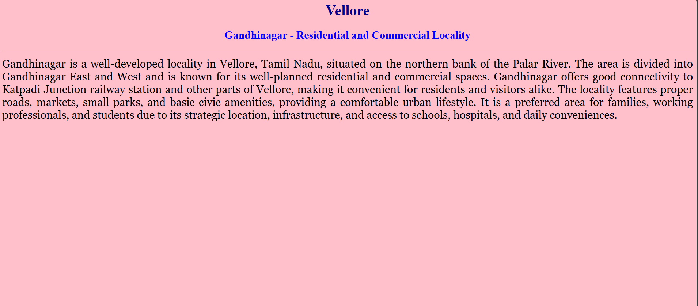
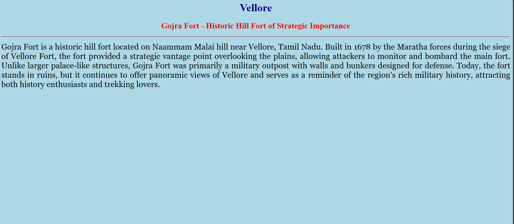
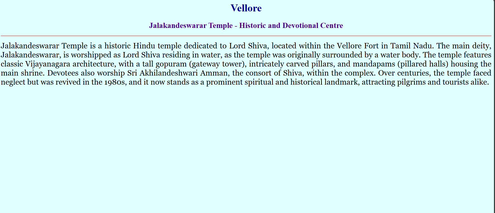

# Ex04 Places Around Me
## Date: 05.12.25
## reference number: 25013407

## AIM
To develop a website to display details about the places around my house.

## DESIGN STEPS

### STEP 1
Create a Django admin interface.

### STEP 2
Download your city map from Google.

### STEP 3
Using ```<map>``` tag name the map.

### STEP 4
Create clickable regions in the image using ```<area>``` tag.

### STEP 5
Write HTML programs for all the regions identified.

### STEP 6
Execute the programs and publish them.

## CODE
~~~
map.html

<html>
<head>
<title>My City</title>
</head>
<body>
<h1 align="center">
<font color="#db23b6"><b>Vellore</b></font>
</h1>
<h3 align="center">
<font color="#211af0"><b>Sadhana K (25013407)</b></font>
</h3>
<center>

<map name="MyCity">
<area target="" alt="home" title="home" href="home.html" coords="1279,502,1465,569" shape="rect">
<area target="" alt="jalakandeswarar" title="jalakandeswarar" href="jalakandeswarar.html" coords="757,484,939,551" shape="rect">
<area target="" alt="gojra" title="gojra" href="gojra.html" coords="1468,681,1624,754" shape="rect">
<area target="" alt="periyar" title="periyar" href="periyarpark.html" coords="859,687,1047,760" shape="rect">
<area target="" alt="ganthinagar" title="ganthinagar" href="ganthinagar.html" coords="507,413,666,472" shape="rect">
</map>
</center>
</body>
</html>

ganthinagar.html

<html>
<head>
<title>My Home Town</title>
</head>
<body bgcolor="pink">
<h1 align="center">
<font color="#00008B" size="6"><b>Vellore</b></font>
</h1>
<h3 align="center">
<font color="blue"  size="5"><b>Gandhinagar - Residential and Commercial Locality</b></font>
</h3>
<hr size="1" color="darkred">
<p align="justify">
<font face="Georgia" size="5">
Gandhinagar is a well-developed locality in Vellore, Tamil Nadu, situated on the northern bank of the Palar River. The area is divided into Gandhinagar East and West and is known for its well-planned residential and commercial spaces. Gandhinagar offers good connectivity to Katpadi Junction railway station and other parts of Vellore, making it convenient for residents and visitors alike. The locality features proper roads, markets, small parks, and basic civic amenities, providing a comfortable urban lifestyle. It is a preferred area for families, working professionals, and students due to its strategic location, infrastructure, and access to schools, hospitals, and daily conveniences.
</font>
</p>
</body>
</html>

gojra.html

<html>
<head>
<title>My Home Town</title>
</head>
<body bgcolor="lightblue">
<h1 align="center">
<font color="#00008B" size="6"><b>Vellore</b></font>
</h1>
<h3 align="center">
<font color="red" size="5"><b>Gojra Fort - Historic Hill Fort of Strategic Importance</b></font>
</h3>
<hr size="1" color="darkred">
<p align="justify">
<font face="Georgia" size="5">
Gojra Fort is a historic hill fort located on Naammam Malai hill near Vellore, Tamil Nadu. Built in 1678 by the Maratha forces during the siege of Vellore Fort, the fort provided a strategic vantage point overlooking the plains, allowing attackers to monitor and bombard the main fort. Unlike larger palace-like structures, Gojra Fort was primarily a military outpost with walls and bunkers designed for defense. Today, the fort stands in ruins, but it continues to offer panoramic views of Vellore and serves as a reminder of the region's rich military history, attracting both history enthusiasts and trekking lovers.
</font>
</p>
</body>
</html>

home.html

<html>
<head>
<title>My Home Town</title>
</head>
<body bgcolor="#E6E6FA">
<h1 align="center">
<font color="#00008B" size="6"><b>Vellore</b></font>
</h1>
<h3 align="center">
<font color="#800000"  size="5"><b>Saidapet - Residential Neighbourhood with Local Amenities</b></font>
</h3>
<hr size="1" color="darkred">
<p align="justify">
<font face="Georgia" size="5">
Saidapet is a residential locality in Vellore, Tamil Nadu, known for its community-oriented neighbourhood and basic urban amenities. Located within the city, it has good connectivity to nearby railway stations, markets, and schools, making it convenient for daily life. The area features small streets, local shops, and parks, providing essential services for residents. Saidapet is home to many families and working professionals who benefit from its proximity to commercial areas and civic facilities, making it a practical and comfortable place to live within Vellore.
</font>
</p>
</body>
</html>

jalakandeswarar.html

<html>
<head>
<title>My Home Town</title>
</head>
<body bgcolor="#E0FFFF">
<h1 align="center">
<font color="#00008B" size="6"><b>Vellore</b></font>
</h1>
<h3 align="center">
<font color="#4B0082" size="5"><b>Jalakandeswarar Temple - Historic and Devotional Centre</b></font>
</h3>
<hr size="1" color="darkred">
<p align="justify">
<font face="Georgia" size="5">
Jalakandeswarar Temple is a historic Hindu temple dedicated to Lord Shiva, located within the Vellore Fort in Tamil Nadu. The main deity, Jalakandeswarar, is worshipped as Lord Shiva residing in water, as the temple was originally surrounded by a water body. The temple features classic Vijayanagara architecture, with a tall gopuram (gateway tower), intricately carved pillars, and mandapams (pillared halls) housing the main shrine. Devotees also worship Sri Akhilandeshwari Amman, the consort of Shiva, within the complex. Over centuries, the temple faced neglect but was revived in the 1980s, and it now stands as a prominent spiritual and historical landmark, attracting pilgrims and tourists alike.
</p>
</body>
</html>

periyarpark.html

<html>
<head>
<title>My Home Town</title>
</head>
<body bgcolor="#E0FFFF">
<h1 align="center">
<font color="#00008B" size="6"><b>Vellore</b></font>
</h1>
<h3 align="center">
<font color="#4B0082" size="5"><b>Jalakandeswarar Temple - Historic and Devotional Centre</b></font>
</h3>
<hr size="1" color="darkred">
<p align="justify">
<font face="Georgia" size="5">
Jalakandeswarar Temple is a historic Hindu temple dedicated to Lord Shiva, located within the Vellore Fort in Tamil Nadu. The main deity, Jalakandeswarar, is worshipped as Lord Shiva residing in water, as the temple was originally surrounded by a water body. The temple features classic Vijayanagara architecture, with a tall gopuram (gateway tower), intricately carved pillars, and mandapams (pillared halls) housing the main shrine. Devotees also worship Sri Akhilandeshwari Amman, the consort of Shiva, within the complex. Over centuries, the temple faced neglect but was revived in the 1980s, and it now stands as a prominent spiritual and historical landmark, attracting pilgrims and tourists alike.
</p>
</body>
</html>
~~~


## OUTPUT





## RESULT
The program for implementing image maps using HTML is executed successfully.
